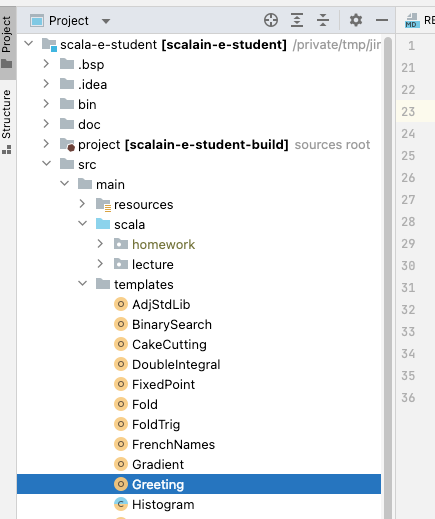
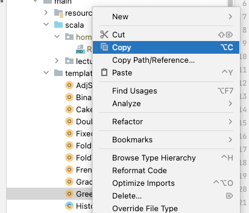
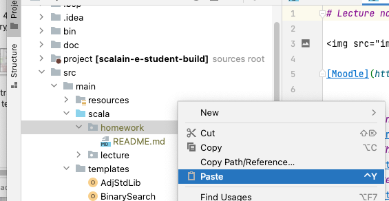
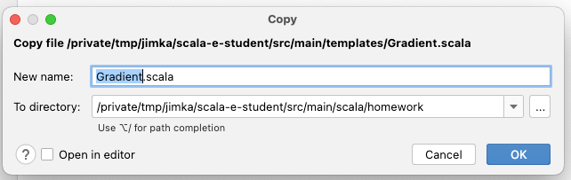
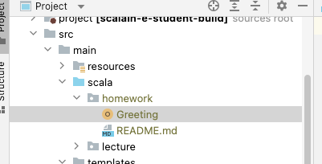
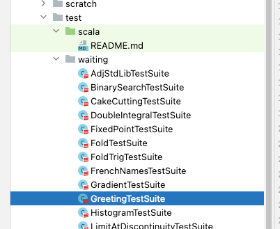
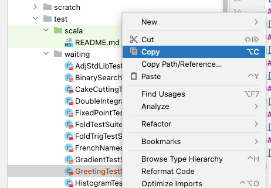
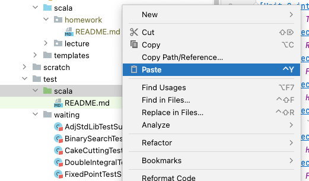
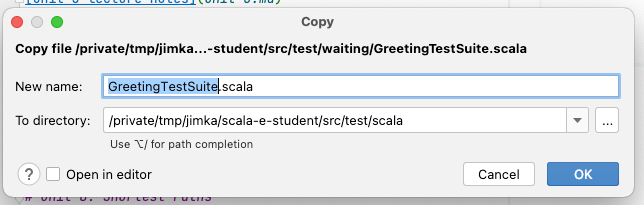
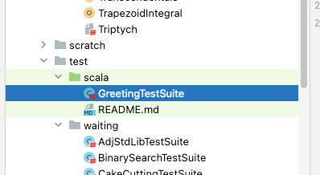

## Copy the homework template file

Make sure to go a `git pull` as necessary.  The homework file will have a name such as `Something.scala` you
should copy this file from `src/mail/templates` into your `src/main/scala/homework` directory of
your project without renaming, so that it is visible to IntelliJ and
to the Scala compiler.  You must also copy the test case file named `SomethingTestSuite.scala` from
the `src/test/waiting` directory to the `src/test/scala` directory.

You may copy the files simply from your OS (Linux, MacOS, etc),
or you can use the file browser in IntelliJ.

Find the file to copy.

Activate the Copy menu item.

Find the destination where you want to copy the file to, and
activate the Paste menu item.

Press OK on the dialog box.

See that the file has been copied into the correct place.

## Copy the test suite file

You must also copy the test case file named `SomethingTestSuite.scala` from
the `src/test/waiting` directory to the `src/test/scala` directory.

You may copy the files simply from your OS (Linux, MacOS, etc),
or you can use the file browser in IntelliJ.

Find the file to copy.

Activate the Copy menu item.

Locate the destination and active the Paste menu item.

Press OK on the dialog pop up.

You should be able to verify that the copy was successful.

