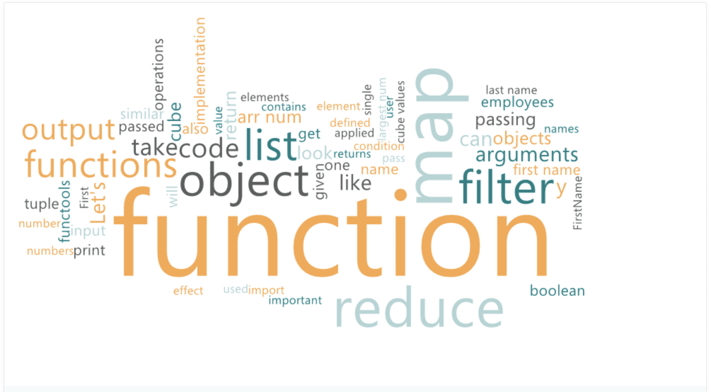

# Lecture notes for Scala introduction

[Moodle](https://moodle.cri.epita.fr/course/view.php?id=749)

# Unit 0: Introduction
[Unit 0 introduction](unit-0.md)
# Unit 1: The Basics
[Unit 1 lecture notes](unit-1.md)
# Unit 2: Recursion
[Unit 2 lecture notes](unit-2.md)
# Unit 3: Functional Style Graphs
[Unit 3 lecture notes](unit-3.md)
# Unit 4: Higher Order Functions
[Unit 4 lecture notes](unit-4.md)
# Unit 5: `for` Comprehensions and Sequence Manipulation
[Unit 5 lecture notes](unit-5.md)
# Unit 6: Higher Order Functions (continued)
[Unit 6 lecture notes](unit-6.md)
# Unit 7: Functional Style Object Orientation
[Unit 7 lecture notes](unit-7.md)
# Unit 8: Shortest Paths
[Unit 8 lecture notes](unit-8.md)
