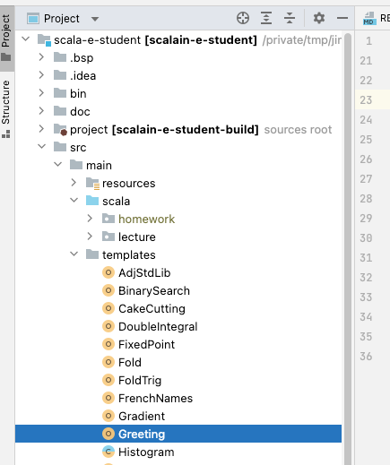
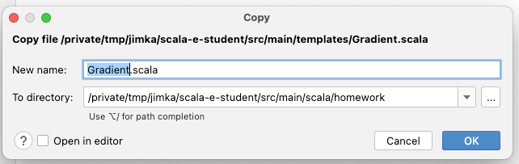
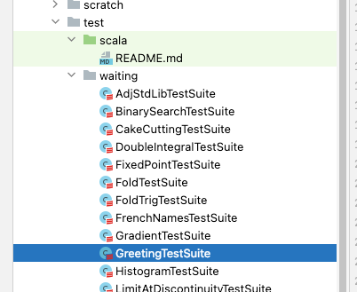
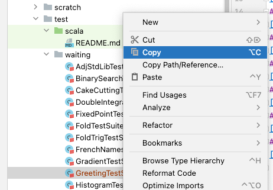
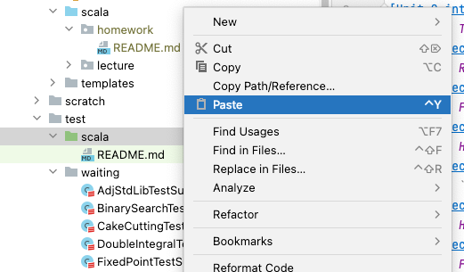
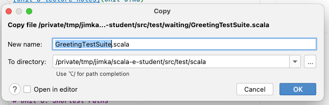
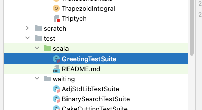

[Forward to Unit 1](unit-1.md)

# Unit 0 -- Introduction


# Introduction

This course is an introduction to functional programming using
the Scala programming language.  Scala is an interesting project which
combines both functional and object-oriented paradigms for programming
applications on the JVM.  In this class we will barely scratch the
surface of the language.  My hope, as your instructor, is to show you
enough to make you interested and intrigued.  Even if you don't use
Scala in your day to day work, understanding more paradigms and
problem solving approaches will make you are more effective problem
solver.

# Integrity of your work 

Each student is expected to complete his own work. You are welcome and
encouraged to help your classmates, but please respect their endeavor
to solve the problems themselves.


# About lectures
The lectures and background material will be in English.

The lectures will occur in a live classroom setting, and all the
students enrolled in the course are expected to attend all lectures.

The lectures will be a mixture of introducing concepts and problem
solving using those concepts. The code developed in the lectures is
available to the students, and the students are responsible for
understanding all the code presented during the lectures. Occasionally
(perhaps often) we will attempt to solve problems using the Scala
langauge, problems which require understanding other concepts of
mathematics or computer science. Students are also required to review
these prerequisite course as necessary.  However, new topics which are
introduced in this course will be introduced adequately in the
lectures.

We are assuming the student has already attended courses in
introduction to programming in some language (OCaml or Python for
example), as well as THEG (Graph Theory).

Getting the code and notes You will need to clone the git repository

```
git clone https://gitlab.lrde.epita.fr/jnewton/scala-e-student.git
```

This repository contains 
- the lecture notes (in the form of md files),
- the example code developed in class
- the homework templates
- the test cases which will be used to grade your submissions.

# Homework
All student excercises can be found `src/main/templates`, called the
`templates` directory, in
[scala-e-student](https://gitlab.lrde.epita.fr/jnewton/scala-e-student)
and in `src/main/templates`, called the `templates` directory.  There
are corresponding test case files in the `src/test/waiting` directory,
called the `waiting` directory.

On the day of the lecture (if not before), a set of deliverables
becomes available and visible on the Moodle. Students have until the designated
time/day to finish and attach a solution file and submit to the Moodle
question.  I (the instructor) will attempt to have the exercises
graded before the next lecture begins.

Whenever you find an assignment in the Moodle, there is an associated
template homework file in the `templates` directory and an associated
test case file in the `waiting` directory.  You'll need to find *both*
files and copy them into the correct directory in your project.

## Copy the homework template file

Make sure to go a `git pull` as necessary.  The homework file will have a name such as `Something.scala` you
should copy this file from `src/mail/templates` into your `src/main/scala/homework` directory of
your project without renaming, so that it is visible to IntelliJ and
to the Scala compiler.  You must also copy the test case file named `SomethingTestSuite.scala` from
the `src/test/waiting` directory to the `src/test/scala` directory.


You may copy the files simply from your OS (Linux, MacOS, etc),
or you can use the file browser in IntelliJ.

Find the file to copy.



Activate the Copy menu item.


Find the destination where you want to copy the file to, and
activate the Paste menu item.


Press OK on the dialog box.



See that the file has been copied into the correct place.


## Copy the test suite file

You must also copy the test case file named `SomethingTestSuite.scala` from
the `src/test/waiting` directory to the `src/test/scala` directory.


You may copy the files simply from your OS (Linux, MacOS, etc),
or you can use the file browser in IntelliJ.

Find the file to copy.




Activate the Copy menu item.



Locate the destination and active the Paste menu item.



Press OK on the dialog pop up.



You should be able to verify that the copy was successful.



## How to complete the homework assignment

NEVER EDIT THE CONTENT OF THE FILES IN THE `templates` DIRECTORY OR THE `waiting` DIRECTORY!

Why? Because this may cause conflicts on the next `git pull`
operation.  Only edit the files after copying them to the `homework`
directory.

You are free to add *additional tests* in the test suite file
`SomethingTestSuite.scala`, but you should not remove tests, because
your grade will depend on the test originally in the file.  The
auto-grader does not know about your edits.

Your task is to find all the occurrences of `???` within the
student-template file and replace with the correct Scala incantation
so that the corresponding tests pass. 


 When you have finished updating
the file to work correctly, submit the file via the Moodle 
`Add Submission` button at the bottom of each assignment page.


Submit only the homework file onto the Moodle, from your `homework`
directory.  Never submit the `...TestSuite.scala` file onto the
Moodle.


If some part of this process is unclear, or if you find instructions
which you know or believe to be wrong, please let me know so I can fix
it.  In such a case I will update the `templates` directory (or other
directories as necessary), and the students will need to again: `git pull`.

If you have problems with the exercises please contact me either in
the chat facility of Microsoft Teams or by email
(`jnewton@lrde.epita.fr`).

If you find the homework problems too easy, and would like something
more challenging, please let me know.

# How is homework graded?

Your grade will be computed based on whether the tests pass.  The
semi-automatic grader will use the same test cases which you, the
student, have access to.   The Moodle DOES NOT automatically run the grader.
This means, unfortunately, you will not see your score when you submitt.
You must wait until I (the instructor) grade your submission.

There are no hidden tests.

This means that if your tests pass in your own IntelliJ sessions, then
they should also pass in the automatic grader.   There are some exceptions:
In particular, the grader will include some lecture `.scala` files if they
are ALREADY noted with `include` in the homework file.  But you MUST NOT
add additional `include` statements referencing lecture files.
You may `include` standard library files as necessary, but not other files
from your project.

In some cases your code will be also subject to a style
criteria.  This criteria will attempt to determine whether you used
good functional style, and you may be subject to penalties if you have
used an imperative style such as mutable variables, or mutable data
structures.

# How to run the test suites

Please assure that you do a `git pull` to make sure you the newest
version of each of the files.

Test suites are provided for all the homework assignments in this
course.  Relative to the project directory, the test case files must be placed at
the path `src/test/scala/`.  You can find the original test suite files
in the `src/test/waiting/` directory.
To run any one of the tests, you
may point the mouse to the name of the suite, and use the `Run` menu
item, as shown in the following image.


After the test has completed successfully, you should see something
like the following image displaying the tests which were successful in
green.


If there are failing tests, you should see something like the following.


Simply click in the stacktrace to display the line of code corresponding to the failing test.

<!--  LocalWords:  IntelliJ Scala
 -->
