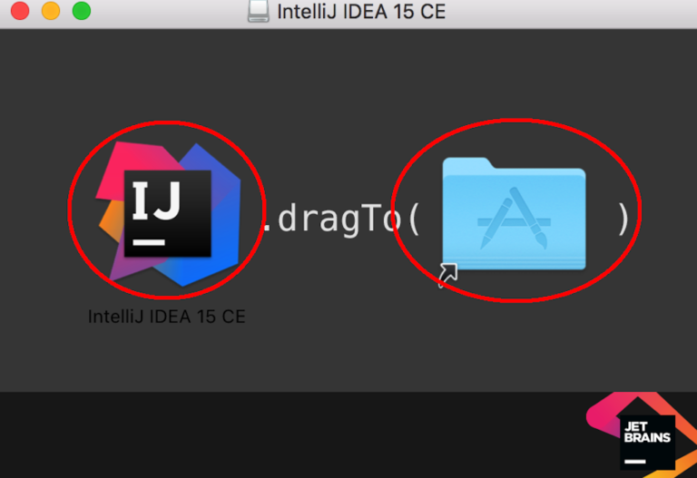
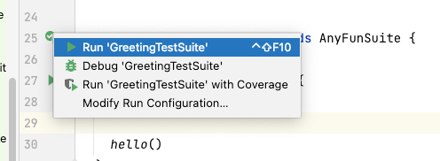
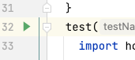

[Back to Unit 0](unit-0.md)  &nbsp;&nbsp;&nbsp;&nbsp; [Forward to Unit 2](unit-2.md)

# Unit 1 -- The Basics


# Environment setup

- Install IntelliJ



Installation of IntelliJ and Scala plugin. This introductory course in
Scala programming will primarily use the IntelliJ IDE.  IntelliJ makes
many parts of Scala program development easy and intuitive.
Unfortunately, when it doesn't work it is extremely difficult to
figure out why.

- Install Scala plugin

The link [getting familiar](http://allaboutscala.com/tutorials/chapter-1-getting-familiar-intellij-ide/)
explains the sometimes painful process of installing IntelliJ
including the Scala plugin. Students are asked to install this
software on their personal laptops and be ready to use the editor
during the lectures.

# Project directory structure

There are several important files and directories in your project

- `build.sbt`
- `src/main/scala/homework`
- `src/main/scala/lecture`
- `src/main/templates`
- `src/main/resources`
- `src/test/scala`
- `src/scratch`

# Hello world

Write your first Scala program.


This section is about defining functions and testing them. In this
lecture we will implement the `Hello world` program using the IntelliJ
IDE and the Scala programming language.

The lecture will demonstrate the general flow of developing in
IntelliJ.  It is important to test your code as you develop
it. However, if testing is difficult, it will often get pushed off to
later.  The Scala plugin of IntelliJ makes it is easy to develop tests
along with the application code.

- Testing your code
- Defining unit tests
- Running tests in IntelliJ and debugging

# File structure within a `.scala` file.

- comments
- `package` definition vs directory name
- `object` creating an object
- `def` defining a function within an object or class
- Type delcarations: sometimes manditory, sometimes optional
- Curly braces `{...}` vs single expression
- White space and indentation
- File name vs class/object name
- Running the `main` function
- Use of `Array` is very rare, avoid it if you can.

## File `src/main/scala/lecture/Greeting.scala`

```scala
// IntelliJ expects this file to be inside a directory named lecture
package lecture

// IntelliJ expects the file name to be Greeting.scala
object Greeting {
  def hello():Unit = {
    println("hello world ")
  }
  
  // this is the main function
  def main(argv:Array[String]):Unit = {
    hello()
  }
}
```

## File `src/main/templates/Greeting.scala`

This file can be found in the `templates` directory.  But DO NOT edit it there.
If you do, you may have a conflict on the next `git pull`.  In stead,
copy the file into the `src/main/scala/homework/` directory, and edit it there.
The `git pull` will never pull nor conflict any files in the `homework` directory.


```scala
object Greeting {
  def hello(name:String) = {
    println(???)
  }

  def main(argv:Array[String]):Unit = {
    hello(???)
  }
}
```

Never use an `import` in the template file to reference other files in the project.
If you do, your test will pass in your environment, but will fail in the auto-grader,
because the auto grader does not have access to your project.

You may, however, add imports to Scala standard library files.

The following is OK.

```scala
// This type of import IS ALLOWED, because the imports do not reference
//   files in your project.
import java.io.InputStream
import scala.io.Source
```

The following is WRONG and your tests will fail in the autograder.
Be careful, sometimes IntelliJ will automatically add `import` to your file.
This can cause problems and can cause your tests to fail.

```scala
// This type of import IS NOT ALLOWED, as they reference files from your project
import lecture.FixedPoint.fixedPoint
import lecture.FloydWarshall._
```

In some templates there ARE ALREADY `import` statements importing from certain lecture
files.   These are OK.  You do not need to worry, and you don't need to remove them.
The auto-grader knows about these includes IF THEY ALREADY appear in the template file.


## File `src/test/scala/GreetingTestSuite.scala`

To make sure your code is correct, you need to find and *run* this test case.
You can do this by selecting the *Run 'GreetingTestSuite'* menu item.



You may also run individual tests within the suite as you like by similar
action any any of the green triangles.




- Testing your program
- Adding tests to the test suite (no penalty for the grader)


```scala
import org.scalatest.funsuite.AnyFunSuite

class GreetingTestSuite extends AnyFunSuite {

  test("greeting") {
    import lecture.Greeting._

    hello()
  }
  test("HW customized greeting") {
    import homework.Greeting._

    hello("jim")
  }
}
```


# Support files


## Lecture files
`src/main/scala/lecture/Greeting.scala`
 
## Homework files
`src/main/templates/Greeting.scala`
`src/test/waiting/GreetingTestSuite.scala`

## Test files
`src/test/scala/GreetingTestSuite.scala`

<!--  LocalWords:  IntelliJ Scala
 -->
