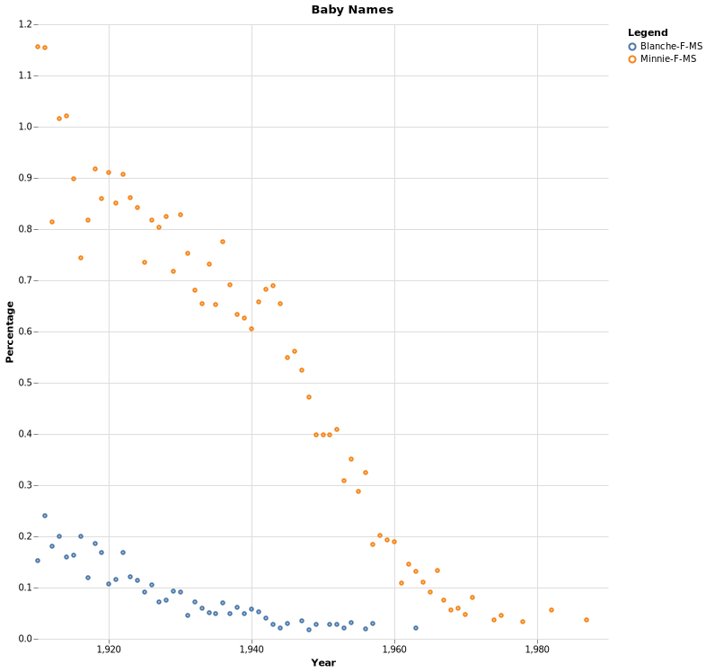

[Back to Unit 4](unit-4.md)  &nbsp;&nbsp;&nbsp;&nbsp; [Forward to Unit 6](unit-6.md)

# Unit 5 -- Standard Library and Comprehensions


# The `for` Comprehension

We will not address monads in a theoretical sense, but rather we we
consider a monad to be a class which is compatible with for
comprehension.

- `for` vs `foreach`
- `for` implementing concentric looping
- `if` for conditionals
- `<-` vs `=`, iteration vs assignment
- Using `for` comprehension to work with any monad, `Set[]`, `List[]`, `Vector[]`, `String`, `Range`, `Iterator`, `Map[]`, `Iterator[]`, `Option[]`

# Example graphing baby name frequencies



We will parse the file
`src/main/resources/US-baby-names/namesbystate/TX.TXT` which is in the
following format.  After parsing we will generate some graphs from the
data.

```
TX,F,2020,Zephaniah,5
TX,F,2020,Zeppelin,5
TX,F,2020,Ziana,5
TX,F,2020,Ziggy,5
TX,F,2020,Zorah,5
TX,M,1910,John,411
TX,M,1910,James,403
TX,M,1910,William,397
TX,M,1910,Robert,276
TX,M,1910,Joe,212
TX,M,1910,Willie,199
TX,M,1910,George,198
```

# Scala Standard Library

This section exercises the skill of writing functions to perform computations on collections.

To complete these assignments you should understand the `List` methods

- `map` vs `flatMap`
- `map`, allows `for{j <- m} yield j`
- `take` vs `drop` vs `splitAt`
- `takeWhile` vs `dropWhile` vs `span`
- `sort` vs `sortWith` vs `sortBy`
- `reverse` and `distinct`
- `filter` and `partition`
- `find` vs `exists`
- `fold` vs `foldLeft`
- `reduce` vs `reduceOption`
- `flatMap`, allows multiple concentric generators
- `filter`, allow `if` expressions to be used after generator. 
- `foreach`, allows `for{j <- m} println(j)`

You may also need the tuples methods such as  `_1`, `_2`, `_3` etc.

Also you should understand the difference between, and how to convert between them `.toSet`, `.toList`, `.toVector`

- `List`
- `Tuple`
- `Set`
- `Vector`

Other interesting methods:

- `groupBy`
- `filter` vs `partition` vs `find`
- `distinct`
- `contains`


# Support files

## Lecture files
- `src/main/scala/lecture/BabyNamePlot.scala`
- `src/main/scala/lecture/VegaPlot.scala`
 
## Homework files
- `src/main/templates/FrenchNames.scala`
- `src/main/templates/CakeCutting.scala`
- `src/main/templates/Fold.scala`
- `src/main/templates/FoldTrig.scala`
- `src/main/AdjStdLib.scala`
- `src/main/RunningAverage.scala`
- `src/test/scala/FrenchNamesTestSuite.scala`
- `src/test/scala/CakeCuttingTestSuite.scala`
- `src/test/waiting/FoldTestSuite.scala`
- `src/test/waiting/FoldTrigTestSuite.scala`
- `src/test/waiting/RunningAverageTestSuite.scala`
