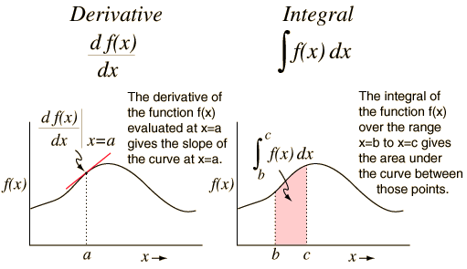

[Back to Unit 5](unit-5.md)  &nbsp;&nbsp;&nbsp;&nbsp; [Forward to Unit 7](unit-7.md)

# Unit 6 - Convergence

Calculus as application of higher order functions

In this section we will implement limits, differentiation, and
integration. Central to functional programming is the programmatic
manipulation of functions.

In this section we look more at functions which operate on functions,
in particular we introduce the concept of Currying and partially
evaluated functions.

First, as you have seen in the development of calculus, we start with
introducing the limit, and continue deriving the derivative and
integral from the limit definition.

## Support files

### Lecture files
- `src/main/scala/lecture/Calculus.scala`
 
### Homework files
- `src/main/templates/LimitAtDiscontinuity.scala`
- `src/main/templates/Gradient.scala`
- `src/main/templates/TrapezoidIntegral.scala`
- `src/main/templates/DoubleIntegral.scala` (optional)
- `src/test/waiting/CalculusTestSuite.scala`
- `src/test/waiting/LimitAtDiscontinuityTestSuite.scala`
- `src/test/waiting/TrapezoidIntegralTestSuite.scala`

